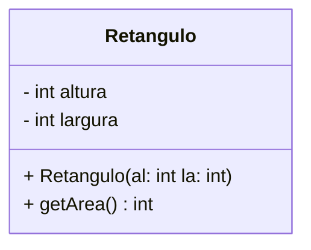

# Diagrama de classes UML

## Codigo Java
``` java 
public class Pessoa{
    private Strinf nome;
}
```
## Diagrama UML


```mermaid
classDiagram
    class Retangulo{
    - int altura
    - int largura
    + Retangulo(al: int la: int) 
    + getArea() int
    }
```

