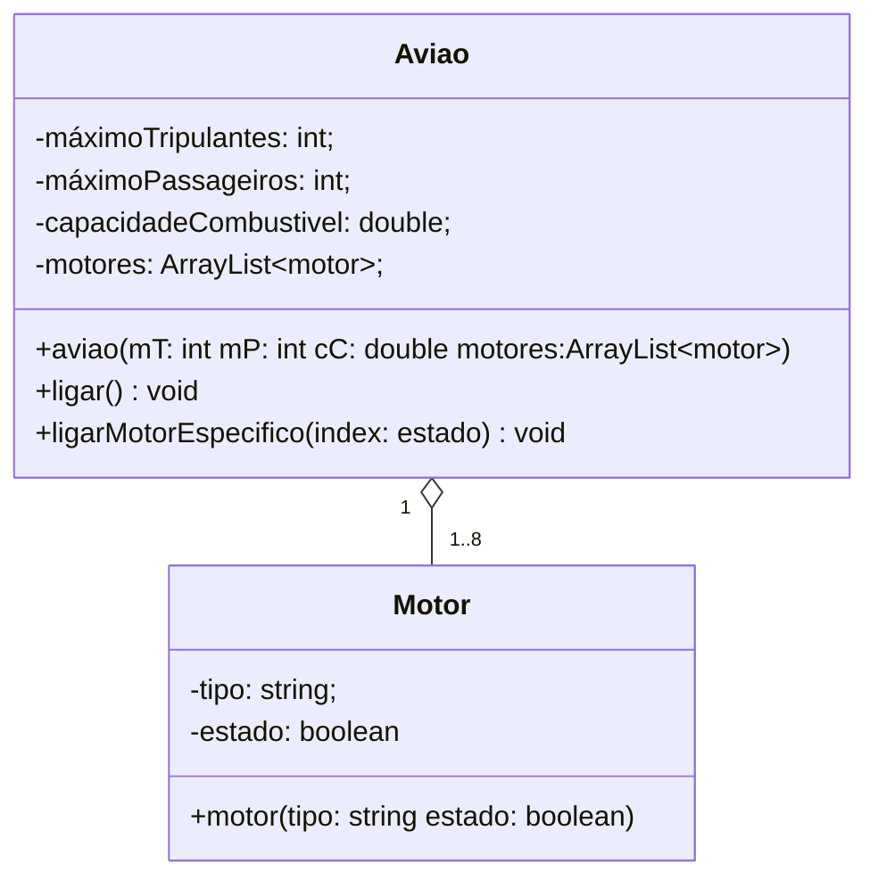

# Diagrama de classes Avião

```mermaid
classDiagram
    class Aviao{
    -máximoTripulantes: int;
    -máximoPassageiros: int;
    -capacidadeCombustivel: double; 
    -motores: ArrayList~motor~;
    +aviao(mT: int mP: int cC: double motores:ArrayList~motor~)
    +ligar() void
    +ligarMotorEspecifico(index: estado) void
    }
    class Motor{
    -tipo: string;
    -estado: boolean
    +motor(tipo: string estado: boolean)
    }
    Aviao "1"o--" 1..8" Motor
```