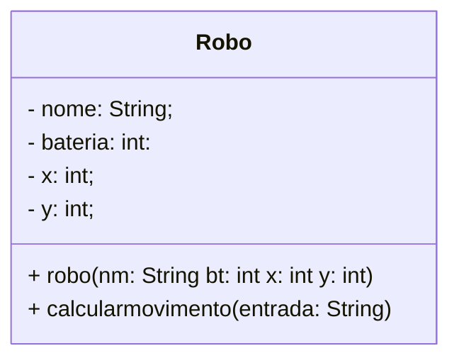

# Diagrama de classes Robo

```mermaid
classDiagram
    class Robo{
    - nome: String;
    - bateria: int:
    - x: int;
    - y: int;
    + robo(nm: String bt: int x: int y: int)
    + calcularmovimento(entrada: String)
    
    }
```