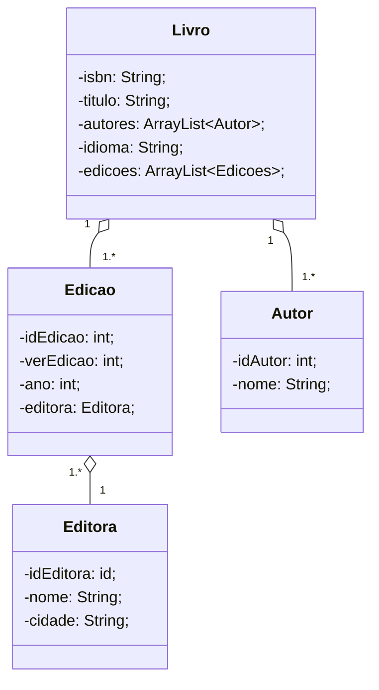
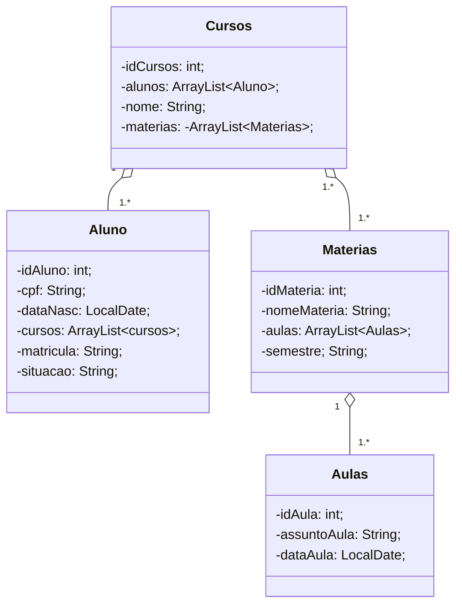
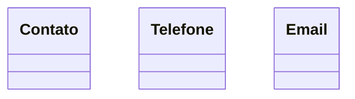

### Diagrama de classes Livro

```mermaid
classDiagram
class Livro{
    -isbn: String;
    -titulo: String;
    -autores: ArrayList~Autor~;
    -idioma: String;
    -edicoes: ArrayList~Edicoes~;
}
class Edicao{
    -idEdicao: int;
    -verEdicao: int;
    -ano: int;
    -editora: Editora;
}
class Autor{
    -idAutor: int;
    -nome: String;
}
class Editora{
    -idEditora: id;
    -nome: String;
    -cidade: String;
}
Livro "1"o--" 1.*"Autor 
Livro "1"o--"1.*"Edicao
Edicao "1.*" o-- "1" Editora
```
### Diagrama Sistema Academico

```mermaid
classDiagram
class Aluno{
    -idAluno: int;
    -cpf: String;
    -dataNasc: LocalDate;
    -cursos: ArrayList~cursos~;
    -matricula: String;
    -situacao: String;
}
class Cursos{
    -idCursos: int;
    -alunos: ArrayList~Aluno~;
    -nome: String;
    -materias: -ArrayList~Materias~;
}
class Materias{
    -idMateria: int;
    -nomeMateria: String;
    -aulas: ArrayList~Aulas~;
    -semestre; String;
}
class Aulas{
    -idAula: int;
    -assuntoAula: String;
    -dataAula: LocalDate;
}
Cursos "1" o-- "1.*" Aluno
Cursos "1.*" o-- "1.*" Materias
Materias "1" o-- "1.*" Aulas
```
### Diagrama Agenda Telefonica

```mermaid
classDiagram
class Contato {

}
class Telefone{
    
}
class Email{
    
}
```