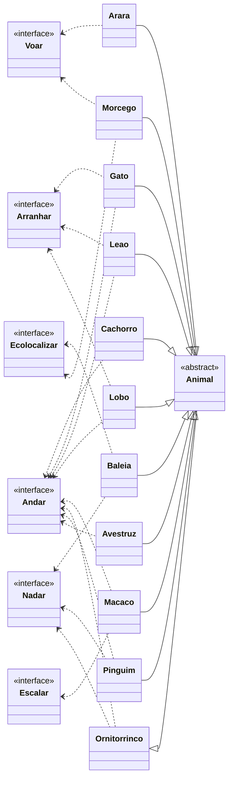

```mermaid
    classDiagram
        direction LR
        class Arara{

        }
        class Avestruz{

        }
        class Baleia{

        }
        class Cachorro{

        }
        class Gato{

        }
        class Leao{

        }
        class Lobo{

        }
        class Macaco{

        }
        class Morcego{

        }
        class Pinguim{

        }
        class Ornitorrinco{

        }


        class Animal{
            <<abstract>>
        }


        class Andar{
            <<interface>>

        }
        class Nadar{
            <<interface>>

        }
        class Voar{
            <<interface>>

        }
        class Arranhar{
            <<interface>>

        }
        class Ecolocalizar{
            <<interface>>
        }
        class Escalar{
            <<interface>>
        }
        


        Arara --|> Animal
        Avestruz --|> Animal
        Baleia --|> Animal
        Cachorro --|> Animal
        Gato --|> Animal
        Leao --|> Animal
        Lobo --|> Animal
        Macaco --|>  Animal
        Morcego --|>  Animal
        Pinguim --|> Animal
        Ornitorrinco <|-- Animal

        Andar <.. Cachorro
        Andar <.. Gato
        Andar <.. Leao
        Andar <.. Lobo
        Andar <.. Macaco
        Andar <.. Ornitorrinco
        Andar <.. Pinguim
        Andar <.. Avestruz

        Nadar <.. Baleia
        Nadar <.. Pinguim
        Nadar <.. Ornitorrinco
        
        Voar <.. Arara
        Voar <.. Morcego

        Arranhar <.. Gato
        Arranhar <.. Leao
        Arranhar <.. Lobo

        Ecolocalizar <.. Baleia
        Ecolocalizar <.. Morcego

        
        Escalar <.. Macaco

```    